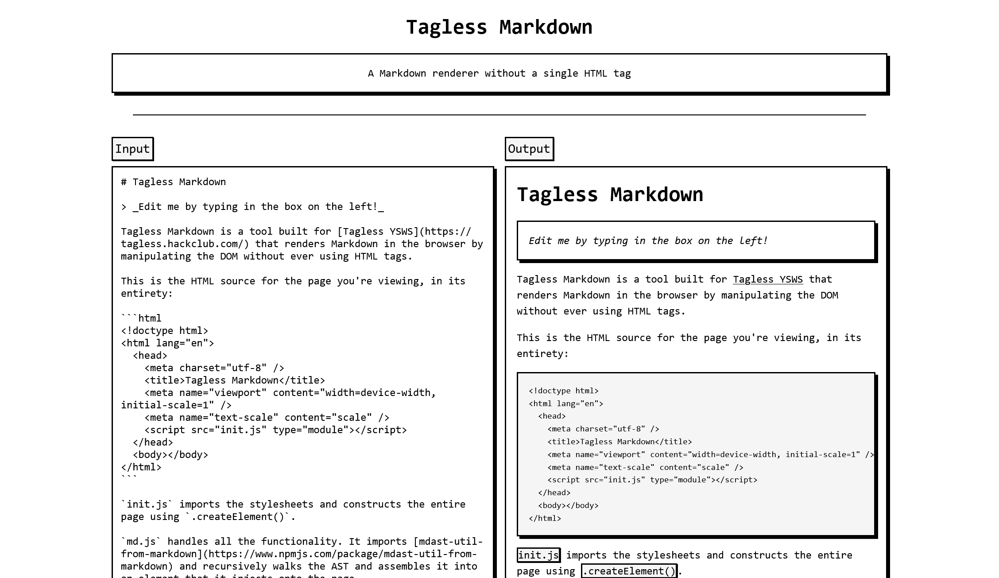

# Tagless Markdown

Markdown renderer site that doesn't use any HTML tags

## How it Works

To create and manipulate DOM elements without using HTML tags, I mostly used `.createElement()` and `.appendChild()`.

### The page

The page elements (e.g. the header, the footer, the textarea, and the output) are assembled in the `getContainer()` function and injected into the page body.

Importing stylesheets via `<link rel="stylesheet">` isn't allowed, but I didn't want to embed all of the stylesheets directly in `index.html` because that's smelly code. So instead, I put them in CSS files and used JS to inject them using the `with { type: "css" }` [import attribute](https://developer.mozilla.org/en-US/docs/Web/JavaScript/Reference/Statements/import/with) and `document.adoptedStyleSheets`.

### The renderer

Obviously, the core of this markdown renderer site is the markdown renderer. Here's the steps:

1. The string content of the textarea is fed into my `mdToEl()` function.
2. The string is parsed into an AST using [mdast-util-from-markdown](https://www.npmjs.com/package/mdast-util-from-markdown)
3. Each child node of the AST is passed into my `processNode()` function
4. `processNode()` is mostly just one giant `switch` statement that routes each node type into the corresponding logic to create its corresponding element. For example, if the node type is `blockquote`, it calls `document.createElement("blockquote")`.
5. After the switch statement, `processNode()` checks if the node has any children. If it does, it recursively processes them by passing them into `processNode()`, which repeats steps 4-6 for each of the children.
6. Once the children are processed, `processNode()` returns the created element (with the children attached)
7. Once the entire AST has been walked, parsed into elements, and appended to the root element, `mdToEl()` returns the root element to be injected into the page.
